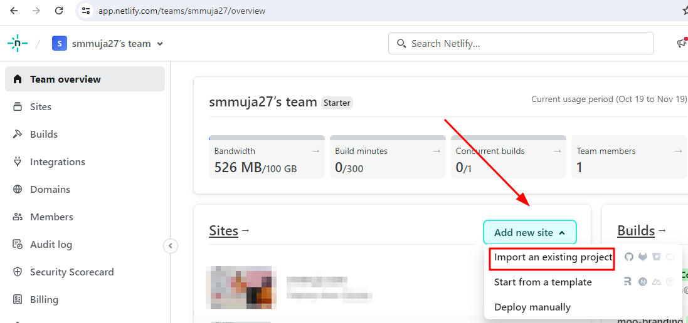

# Moo Branding
<p>A fictional Company Profile</p>

## Deployed here:
https://moo-branding.netlify.app/

## This documentation include
- About the project
- Netlify Deploy
- Custom domain
- The Author

## 
## This Company Profile include:
- Home
- Service Section
- Portfolio Section
- Call to action 
- Call to action goal : Make a purchase


## Version
### Version 2 (Latest)
Link : https://moo2.smmuja.com/

### Version 1.3
Link : https://moo-branding.netlify.app/
<!-- - Desktop View

- Mobile View
 -->

### Version 1.2
Link : https://moo-branding-2.netlify.app/

### Version 1
Link : https://moo-branding-1.netlify.app/


## Netlify Deploy
This project is deployed and hosted on Netlify. Here's how
1. Create a Netlify account at https://www.netlify.com/
2. After account is created you will see the home dashboard here, go to "Add new site" section

3. We will use Github autodeploy, so let's choose Github

4. Choose the organization and repository you want to deploy

5. Here we will use the default seting, so just go on and click "Deploy"

6. Yor site is accessible via Netlify subdomain


## Custom Domain 
1. Buy your own domain via https://niagahoster.co.id/

2. Go to Netlify > Domain Management > Input your custom domain


3. Get the DNS records from Netlify


4. Go to Niagahoster > DNS Management. Delete default DNS for A record and WWW CNAME record


5.Add the DNS record from Netlify

6. Website is acessible using your own domain


# About the Author
> Get to know me better 👋🌸
## My Bio
```
Hi, Im Muja, an aspiring Software Engineer
Currently working as a Customer Success Specialist in a web hosting company
```


Coming from a non-tech background, I learn everything I need on the job, and realizing it won't satisfy my aspiration since I need to balance my own goals and company business goals, I decided to pursue another learning journey outside work. After thoughtful consideration of several possible options, RevoU became my choice.

## My Links
- Website: [zayanamuja.com](https://www.zayanamuja.com) 
- Github: [smmuja](https://github.com/smmuja)
- LinkedIn: [Muja S.](https://www.linkedin.com/in/smmuja/)

## My Technical Skills :
1. Blogger :woman_mechanic:
2. Wordpress :globe_with_meridians:
3. cPanel :penguin:

## My Favorite Websites
|Name   |URL    |Reason |
|---    |---    |---    |
|Google |https://www.google.com |Source of many things  |
|Quora  |https://www.quora.com  |Source of inspirations   |
|Instagram  |https://www.instagram.com    |Source of random memes, quotes, and cats|
## My Activities
### Working
```
Hello, how can I help you? 😊👩‍💻
```
1+ year experience of web hosting services and customer interactions

### Learning Software Engineering

1. FSSE (Full Stack Software Engineering)

   - 6 + 3 month full stack Software Engineering Course
   - 💥On going💥

2. FCSE (Fundamental Course Software Engineering)
    - 2-week fundamental course of software engineering
    - Output : [Fictional Company Profile](https://revou-fundamental-course.github.io/29-may-23-smmuja/)

### Blogging

- [zayanamuja.com](https://www.zayanamuja.com) : Personal Blog
- [deardeadliner.com](https://www.deardeadliner.com) : Passion Project

### CATS
<!--  -->

I love talking to my cats in my free time

```
It would be an endless long list so might be better to stop here for now
Basically I'm into many things, let's be friends 🌸
```
